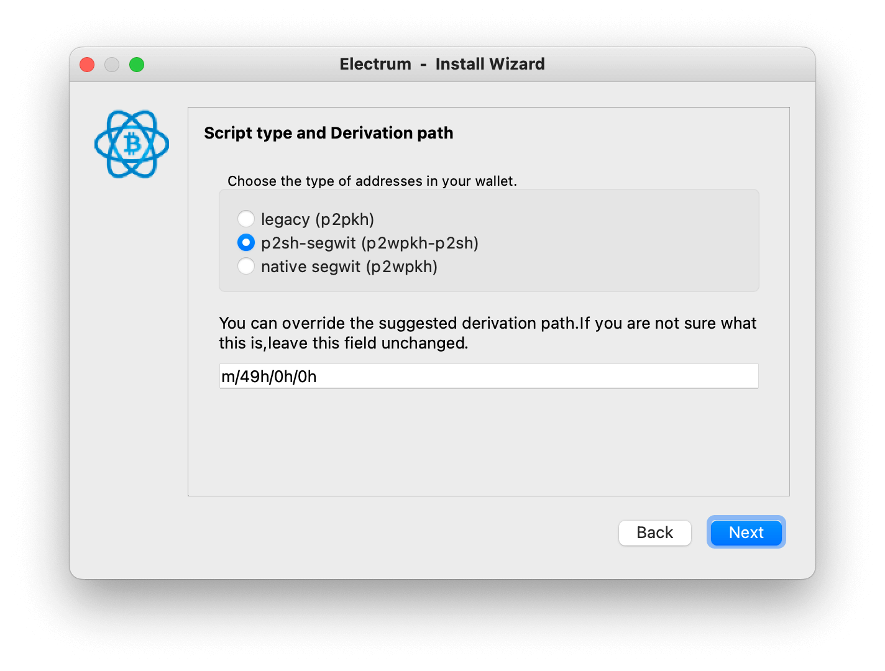
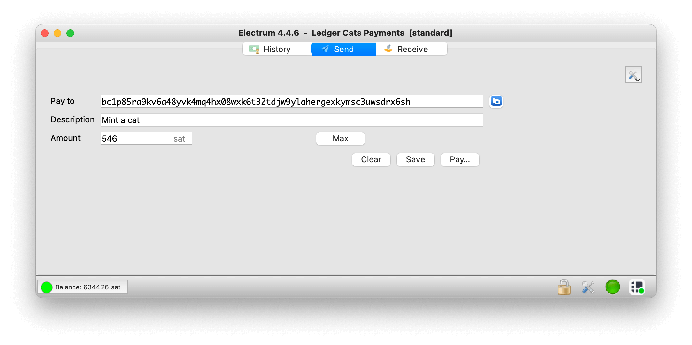
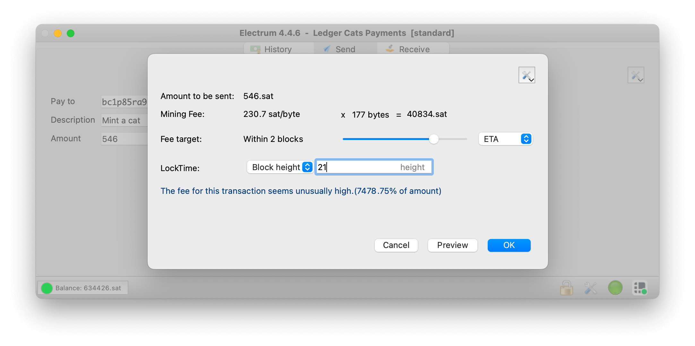

# CAT-21 - How to

## How to mint a CAT-21 asset

### 1. Install Electrum

You need a Bitcoin wallet software that offers you the option to set up the locktime of the transaction.
One compatible Wallet software is [Electrum](https://electrum.org/).
Download, install, and create a new wallet using Electrum.

Tip: All script types are compatible. 
But if you want to receive Bitcoin from a centralized exchange, like Coinbase, choose the script type `p2wpkh-p2sh` – since it's widely supported.

### 2. Setup Units

Go to **Preferences > Units > Base Unit**, and choose `sat`. 
This makes it easier to send the correct amount.

### 3. Receive Bitcoins

If your wallet is empty, go to the **"Receive"** tab and **"Create a Request"**.
Ultimately, you only need the address to receive money.
If you have chosen `p2wpkh-p2sh`, then the address will start with the number `3`.

In this example, the address to receive the money is `351[...]1Pk`.

#### 4. Mint a CAT-21 asset

##### Prepare the payment

As soon as your wallet is funded, you can mint cats!
Go to the tab **"Send"** and enter a valid Taproot address that should receive the cat.
Only Taproot addresses are valid receivers for a CAT-21 mint transaction!
A Taproot address always starts with the prefix `bc1p`.

In this example, we will send a cat to the wallet that holds the Genesis cat, which is `bc1p85ra9kv6a48yvk4mq4hx08wxk6t32tdjw9ylahergexkymsc3uwsdrx6sh`.
Change this to an address you control if you want to mint the cat for yourself.
You can also gift the cat to someone else, if you know they address to receive digital artifacts – like inscriptions, rate sats, or cats!

For the amount you must choose a value which is `546` sat or greater.
Now click on **"Pay…"**.

##### Enable Edit Locktime

Before you send the transaction, make sure that you click on the **"Settings"** button in the top right corner. Enable **"Edit Locktime"**. 

##### Set LockTime to `21`

This is now very important!
The locktime must be exactly `21` (Block height).
Only by having this value the transaction is a valid CAT-21 mint!

Choose a fee rate that fits your budget and time preferrence.
In this example we have chosen a fee rate that should bring our transaction on the chain within 2 blocks – which should take about 20 minutes.

Hint: In this example the suggested fee rates were a bit too high.
The fees according to ordpool.space were around 170 sat/byte to get into the next block. 
If you feel comfortable, then adjust the fee rates manually to pay the optimal price.

Press **"Ok"** to start the mint!
If you use a hardware wallet like Ledger, make sure it's unlocked and that the Bitcoin app is running. Confirm the transaction on the device.

##### View the transaction in the Mempool

The confirmation screen shows you the transaction ID of the mint. 
Copy the number to the clipboard (in this case it's `98316dcb21daaa221865208fe0323616ee6dd84e6020b78bc6908e914ac03892`) and go to 
https://ordpool.space . Enter the transaction ID in the search bar and press **"Go to"** to enter the transaction details page.

Here you can see all details of your transaction and the cat artwork!
Congratulations you minted your first CAT-21 asset and brought a bit more fun and joy to the Bitcoin universe!

